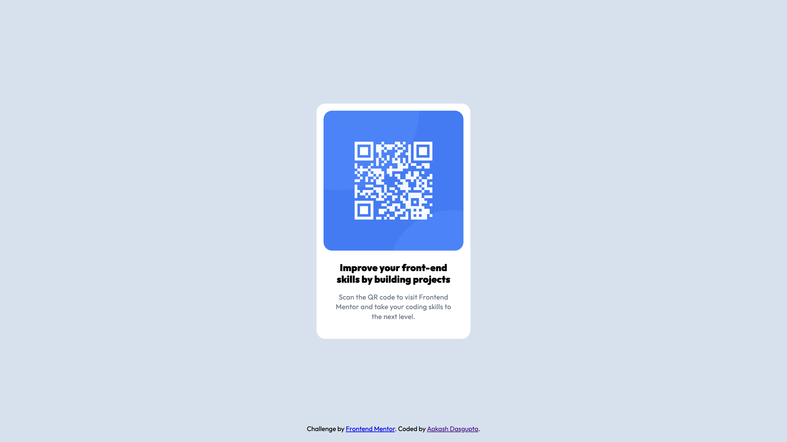

# Frontend Mentor - QR code component solution

This is a solution to the [QR code component challenge on Frontend Mentor](https://www.frontendmentor.io/challenges/qr-code-component-iux_sIO_H). Frontend Mentor challenges help you improve your coding skills by building realistic projects. 

## Table of contents

- [Overview](#overview)
  - [Screenshot](#screenshot)
  - [Links](#links)
- [My process](#my-process)
  - [Built with](#built-with)
  - [What I learned](#what-i-learned)
- [Author](#author)

## Overview
This is the first project of many that I plan to build on front-end mentor. This is a simple responsive QR code component built using basic CSS and media queries. I wanted to challenge myself by not using flexbox in this one.

### Screenshot

### Links
- Live Site URL: [Site URL](https://a-d14.github.io/qr-frontend-mentor/)

## My process
- I always start by resetting all the default browser styles so I can start styling from scratch.
- I split the website into a section that contains the card and a footer.
- Inside the section element is a card element that I centered on the page using a nifty little trick consisting of absolute positioning and the translate function.

### Built with

- HTML5
- CSS3

### What I learned
- This project was my first time using Figma. It was a good experience seeing an emnulation of how a front-end developer and a designer communicate with each other.
- I learned how to use CSS variables.

## Author
- Frontend Mentor - [@a-d14](https://www.frontendmentor.io/profile/a-d14)